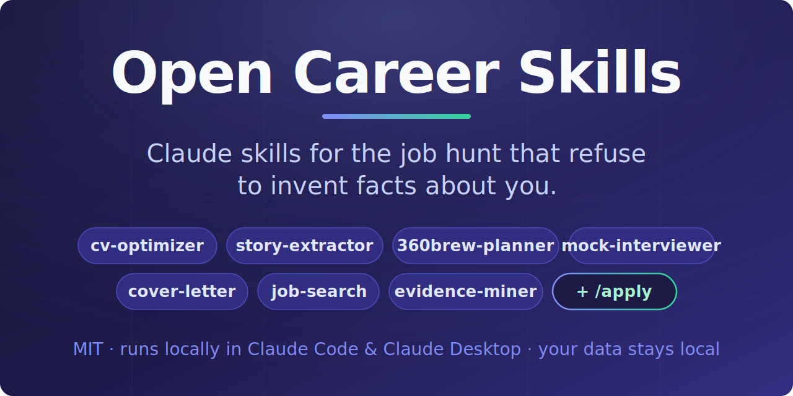
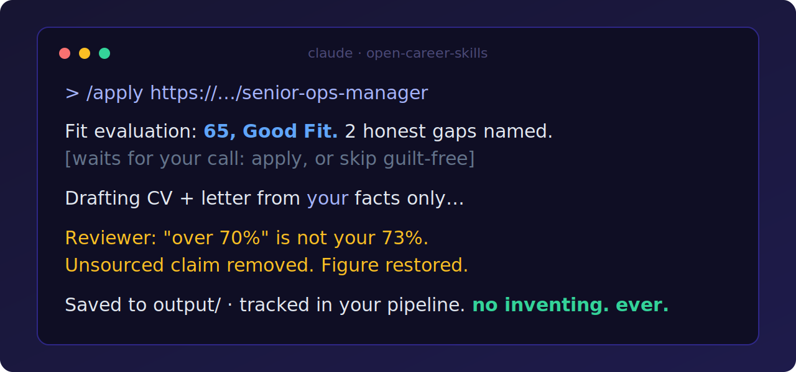

<picture>
  
</picture>

# Open Career Skills

**The prompt architecture behind [JobMentis](https://jobmentis.com/?ref=oss-prompts), open-sourced as installable Claude skills.**

[](LICENSE)
[](CONTRIBUTING.md)

Generic AI career advice gets people rejected: polished emptiness, invented metrics, "results-driven professional" boilerplate that recruiters spot in three seconds. These skills are built the opposite way. Their defining behavior is that they **ask you a question rather than invent a fact about you**, and they enforce the writing craft (plain verbs, real numbers, say-it-out-loud naturalness) that survives both ATS parsers and human readers.

Run them locally in Claude Code or Claude Desktop, on your own subscription, with your data on your machine.

## The five skills

| Skill | What it does | The rule that makes it different |
|---|---|---|
| **ruthless-cv-optimizer** | Rewrites your CV against a specific job description | Two-phase flow: it diagnoses and ASKS about suspect numbers and empty bullets, waits for your answers, then rewrites. Gaps are reported honestly, never papered over. |
| **star-story-extractor** | Turns a messy braindump into a sharp STAR interview story, filed in your story bank | Missing metric: it asks you ONE question instead of estimating. Also matches your bank against any pasted JD. |
| **linkedin-360brew-planner** | Plans and drafts LinkedIn posts under the 2026 ranking rules | Built on LinkedIn's 360Brew decoder model (the reason hashtags and pods died). Saves over likes, analytical first line, pillar discipline. |
| **cover-letter-writer** | A 300-400 word letter grounded in your real stories | Two or three deep JD connections instead of six shallow ones; banned-cliche list enforced. |
| **mock-interviewer** | A pressure-tested rehearsal, one question at a time | Stays in character, interrupts rambling, drills "what did YOU do?", then debriefs against structure / specificity / ownership / quantification. |
| **job-search** | Finds current postings matching your profile | Zero dependencies; only reports jobs it actually fetched or you pasted. Blocked boards get you ready-made search URLs, never invented listings. |
| **evidence-miner** | Harvests real achievements from your git history into the story bank | Groundedness rule: no citable artifact (commits, PRs, dates), no proposed achievement. Business impact numbers come from you, never inferred from code. |

## The /apply pipeline

The skills also compose into one end-to-end flow per job:

<picture>
  
</picture>

The reviewer is a separate subagent that audits every claim in the drafts against your actual profile and stories; anything unsourced gets flagged for removal, not "improved". After the pipeline, `/mock-interview` rehearses the evaluation's real gaps and `/upskill` turns gaps recurring across 2+ applications into a learning plan. Full walkthrough: [docs/WORKFLOW.md](docs/WORKFLOW.md). Per-skill contracts: [docs/SKILLS.md](docs/SKILLS.md). Something misbehaving: [docs/TROUBLESHOOTING.md](docs/TROUBLESHOOTING.md).

## Install

### Option A: fork this workspace (recommended)

The repo is a ready-to-run Claude Code career workspace with file-based memory: your profile in `profile/`, your STAR stories in `story-bank/`, your content calendar in `content/`.

```bash
# fork on GitHub first (keep your fork private if you plan to push), then:
git clone https://github.com/squerne/open-career-skills.git
cd open-career-skills
claude
# then, inside Claude Code:
/setup
```

`/setup` builds your profile from a pasted CV or a guided interview. From there:

```
/find-jobs        # real postings matching your profile, fit-triaged
/apply <url>      # the full pipeline: evaluate, draft, review, track
/optimize-cv      # paste a JD, get a tailored CV in output/
/extract-story    # braindump a win, get a STAR story in story-bank/
/mine-evidence    # harvest achievements from your git history
/plan-content     # 6 post ideas, or draft one post
/cover-letter     # tailored letter in output/
/mock-interview   # one question at a time, debrief at the end
/upskill          # learning plan from gaps recurring across applications
```

Your personal data (`profile/profile.md`, your stories, your calendar, everything in `output/`) is **git-ignored by design**: even if you push your fork publicly, your CV and metrics stay local.

### Option B: install individual skills

Copy any skill folder into your own project or user skills directory:

```bash
cp -r .claude/skills/ruthless-cv-optimizer ~/.claude/skills/
```

Works in Claude Code and Claude Desktop (any agent that reads `SKILL.md` skills). Without the workspace, skills ask you to paste your CV instead of reading `profile/`.

### Option C: plain chat (ChatGPT, claude.ai, Gemini)

The five writing skills have self-contained paste-able versions in [`prompts/`](prompts/). Paste one as your first message and follow along. You lose the file-based memory; the prompts tell you what to paste each time. (`/apply`, `/find-jobs`, `/upskill`, and `/mine-evidence` need file and web tools, so they are Claude Code only.)

## Why we open-sourced this

Prompts are a commodity; anyone can copy text. What they can't copy from a markdown file is the system around it. We build [JobMentis](https://jobmentis.com/?ref=oss-prompts), a career OS where these same engines run against a persistent, structured version of your career: CV analyses, a searchable story bank, a job tracker, and interview intelligence that feed each other automatically.

This repo is the honest free tier. It genuinely works, and we want it to: a job search run on grounded, non-fabricated assets is better for everyone, including the recruiters. What the hosted product adds is scale and statefulness:

| | This repo | JobMentis |
|---|---|---|
| The prompt craft | ✅ identical philosophy | ✅ |
| Your cost | your Claude subscription | free tier + Pro |
| Memory | markdown files in your fork | structured, searchable, cross-device |
| CV ↔ story bank ↔ JD matching | manual, per session | automatic, across your whole pipeline |
| Job pipeline tracking | a folder of files | tracker with per-vendor ATS rules |
| Mock interviews | text chat | live voice, company-specific question banks |
| Personality-aware coaching, human coaches | ❌ | ✅ |

If the flat files start feeling like the bottleneck, that's the moment we built the product for: https://jobmentis.com/en/signup?ref=oss-prompts

## FAQ

**Do these work with models other than Claude?**
The `prompts/` versions work with any capable chat model. The `SKILL.md` versions target Claude Code / Claude Desktop.

**Why do the skills refuse to add metrics to my CV?**
Because invented numbers are the fastest way to fail an interview. The skills ask you for the real figure; if you don't have one, an unquantified true bullet beats a quantified fake one.

**What is 360Brew?**
LinkedIn's decoder-only ranking foundation model (published on arXiv, January 2025). It reads post text directly, which is why hashtags, pods, and link-in-first-comment tricks stopped working. Longer explanation: https://jobmentis.com/en/guide/linkedin-algorithm-guide

**Is my data sent anywhere?**
Only to the model provider you already use (Anthropic, OpenAI, ...). The workspace stores everything in local files, and the `.gitignore` keeps personal files out of your commits.

**Can I contribute a skill?**
Yes. See [CONTRIBUTING.md](CONTRIBUTING.md). The quality bar: no skill may fabricate user facts, ever.

## Acknowledgments / Credits

This repo stands on ideas from two MIT-licensed projects, reimplemented (not copied) for this workspace:

- **[MadsLorentzen/ai-job-search](https://github.com/MadsLorentzen/ai-job-search)**: the fork-and-run workspace pattern, and the concepts behind our `/apply` drafter-reviewer pipeline, the application tracker, and `/upskill` gap analysis. If you want LaTeX/PDF CV output or Danish job-board CLIs, use his repo; it does both better than we ever will in Markdown.
- **[Play-New/apply-new](https://github.com/Play-New/apply-new)**: the principle that career evidence should come from work artifacts and that every prose claim should trace to underlying data. Our `evidence-miner` skill and the reviewer's groundedness audit are descendants of that idea.

## License

MIT. "JobMentis" is a trademark of JobMentis; the license covers the prompts and code in this repo, not the brand.
